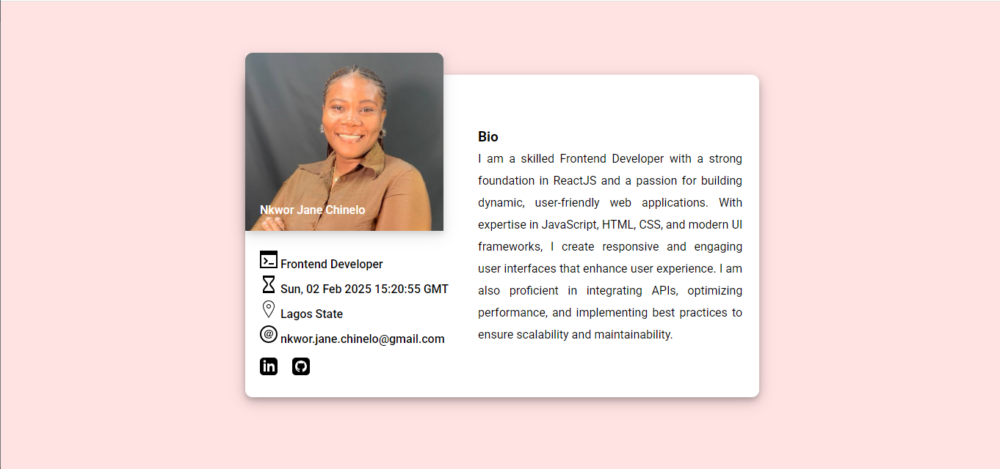

# My Profile Card

## Overview

This is project is for promotion into stage 1 for the HNG Internship Cohort 12. It is  a responsive Profile card made with HTML, CSS, and Vanilla JavaScript. This task is meant to introduce us to responsive design and showcase our frontend skills.

## Features

- **Responsive Design:** Built with Mobile-first responsive design.
- **Dynamic updates:** The UTC time dynamically updates  when page is refreshed.

## Installation

1. CLone the repository: ```javascript git clone https://github.com/Nkwor-Jane/profile_card.git```
2. Navigate to the project: ```javascript cd profile_card```

## Usage

1. Go to the **index.html** page.
2. Right click and select **Open with Live Server**.

## Screenshots

- Desktop View


- Mobile View


## Live Demo

Check out the live demo [here](https://janeprofilecard.netlify.app/)

## Contributing

Feel free to clone and fork this repository. You can also submit pull requests. Any contributions are welcome!

## Acknowledgements

- [HNG](https://hng.tech/internship) for organizing this internship.
- I truly appreciate the mentors and managers for their contributions and guidance towards the successful completion of this task.

Feel free to customize it further to fit your needs! If you have any specific details you'd like to add or change, let me know.
